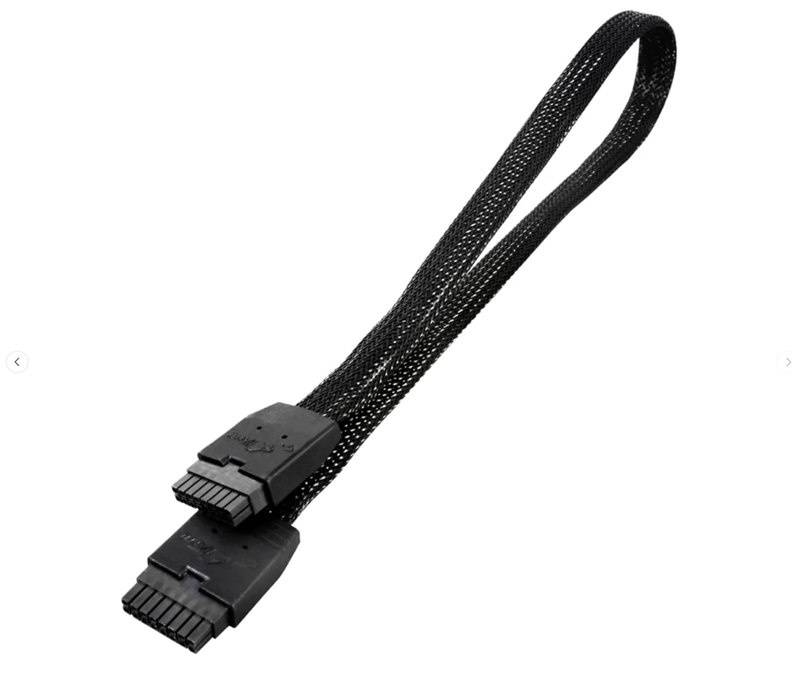

# SL_PCB — Simple Layout Battery Connector PCB

`SL_PCB` is the **dummy/simple-layout PCB** for the Longshot battery. It is not a full BMS board.

The purpose of this board is to:

1. Route high-current power from the battery to the battery connector.
2. Place an **AMX-150 fuse** in the high-current path.
3. Provide a normal exposed charging connector that can be attached to the **Tattu TA3200 charger** with a designated charge cable.
4. Collect cell-voltage sense lines from the four voltage sensing PCBs.
5. Expose those cell-voltage sense lines through a connector compatible with the balancing cable of a **Tattu TA3200 charger**.

This board intentionally does **not** include MOSFET switching, active balancing, MCU control, or BMS firmware functionality.

## Current role in Longshot

The SL_PCB is a low-complexity bridge board for early Longshot battery testing and packaging work. It should keep the electrical path understandable and easy to inspect while the full BMS architecture is still being developed separately.

## High-current path

The high-current path should route battery power directly to the battery connector, with one fuse in series. The board should also expose a normal charging connector that can be connected to the TA3200 charger using a designated charge cable.

```text
Battery high-current terminal → AMX-150 fuse → Battery connector
                                      └→ Exposed charging connector for TA3200 charge cable
```

Design notes:

- Use copper geometry appropriate for the expected current path.
- Keep the fuse accessible/inspectable where practical.
- Do not add MOSFETs, precharge circuitry, current sensing, or BMS switching logic to this PCB unless the project scope changes.
- Include a normal exposed charging connector for the TA3200 charge cable connection.
- Maintain clear creepage/clearance and mechanical separation between the high-current/charging path and low-voltage sense routing.

## Cell-voltage sensing interface

Cell voltages are collected by the voltage sensing PCBs from issue #14:

- `VS_PCB_TR`
- `VS_PCB_TL`
- `VS_PCB_BR`
- `VS_PCB_BL`

Each voltage sensing PCB connects to SL_PCB through a **6-pin JST connector**:

- 3–4 cell voltage sense lines, depending on the board
- `GND`
- `T_SENSE` for the temperature sensor connection

Related issue: [#14 — Design battery voltage sensing boards](https://github.com/Arrow-air/project-longshot/issues/14)

## Charger balancing connector

SL_PCB should expose the collected cell-voltage sense lines through a connector that mates with the balancing cable used by the **Tattu TA3200 charger**.

Reference image:



Connector notes from the reference image:

- The cable uses black, flat, single-row, shrouded connector housings.
- The connector appears keyed/polarized with molded side features.
- The exact connector series, pin pitch, pin numbering, and polarity must be verified from the actual cable, charger documentation, or connector datasheet before fabrication.
- Do not rely on the image alone for pinout or mechanical footprint selection.

## Critical requirements

- The voltage sense pinout must be correct before the board is connected to a charger.
- The four 6-pin JST inputs from the voltage sensing boards must map cleanly to the charger balancing connector.
- Connector orientation and pin numbering must be documented in the schematic and README once finalized.
- The AMX-150 fuse must be in the high-current path.
- The board must include a normal exposed charging connector for a designated cable to the TA3200 charger.
- No MOSFET or BMS functionality should be added to this simple-layout board.

## KiCad project

Open the project with KiCad 9.0+:

```text
engineering/electronics/pcbs/SL_PCB/kicad/SL_PCB.kicad_pro
```

Expected project outputs:

- Updated schematic showing:
  - Battery high-current input/output path
  - AMX-150 fuse
  - Exposed TA3200 charge-cable connector
  - 4× 6-pin JST voltage-sense inputs
  - TA3200-compatible balancing connector output
- Updated PCB layout with the corresponding connector placement and high-current routing
- Fabrication outputs when the layout is ready for review/manufacture

## Open items

- Confirm exact TA3200 balancing connector part number and footprint.
- Confirm exact TA3200 charge connector/cable interface and footprint.
- Confirm the final sense-line ordering from each `VS_PCB_*` board.
- Confirm the complete mapping from the four 6-pin JST inputs to the TA3200 balancing connector.
- Confirm mechanical placement of connectors relative to the Longshot battery assembly.

## License

Hardware: Open Source (license TBD)
